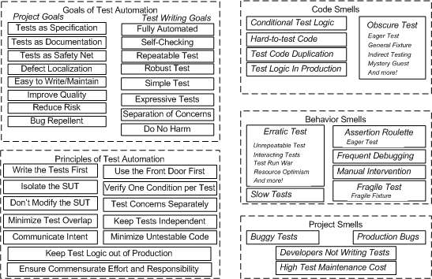

java TDD
=============

Unit Testing
-----------------

[xUnit Test Patterns: Refactoring Test Code](http://xunitpatterns.com/Code%20Refactorings.html)



[stub vs mock](http://stackoverflow.com/a/3459491/432903)

```
Every class or object created is a fake. It is a mock[] if you verify() calls against it. 

Otherwise its a stub[], stub has the behaviour pre-determined, 
```

eg.

```java
class SubjectToTest {
  private Dependency dependency;
  
  public String doSomething(){
      dependency.doSomething() + "-something else"; //dependency.doSomething() is already defined, so its mock[]ed
  }
}

interface DependencyStub {
    String doSomething();
}

class DependencyStubImpl implements DependencyStub {

  public String doSomething(){
     return "something";
  }
}
```

https://8thlight.com/blog/uncle-bob/2014/05/14/TheLittleMocker.html

https://www.amazon.com/dp/0321146530/?tag=stackoverfl08-20

[Using Mockito's ArgumentCaptor in Scala](http://blog.themillhousegroup.com/2013/11/using-mockitos-argumentcaptor-in-scala.html)

[ScalaTest and Mockito: Functions](http://bleibinha.us/blog/2013/11/scalatest-and-mockito-functions)

[Testing styles in ScalaTest : PropSpec with TableDrivenPropertyChecks with Matchers, WordSpec etc](http://yeghishe.github.io/2015/05/31/scalatest-testing-styles.html)

[Suite with ShouldMatchers, FunSuite, FeatureSpec with GivenWhenThen](https://blog.knoldus.com/2011/05/16/working-with-scala-test/)


[scalamock, native scala testing](https://github.com/paulbutcher/scalamock#features)

Code coverage
-------------

[s-coverage plugin](https://github.com/nihil-os/scoverage-maven-plugin)

```
sbt test
```

using maven
---------------------

```
mvn clean test
```


FIXME
------

fix mockito version with powermockito

```bash
java.lang.NoSuchMethodError: 
org.mockito.internal.creation.MockSettingsImpl.setMockName(Lorg/mockito/mock/MockName;)
Lorg/mockito/internal/creation/settings/CreationSettings;
```

